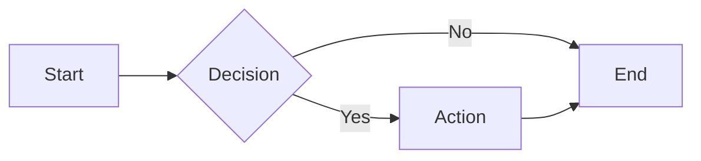
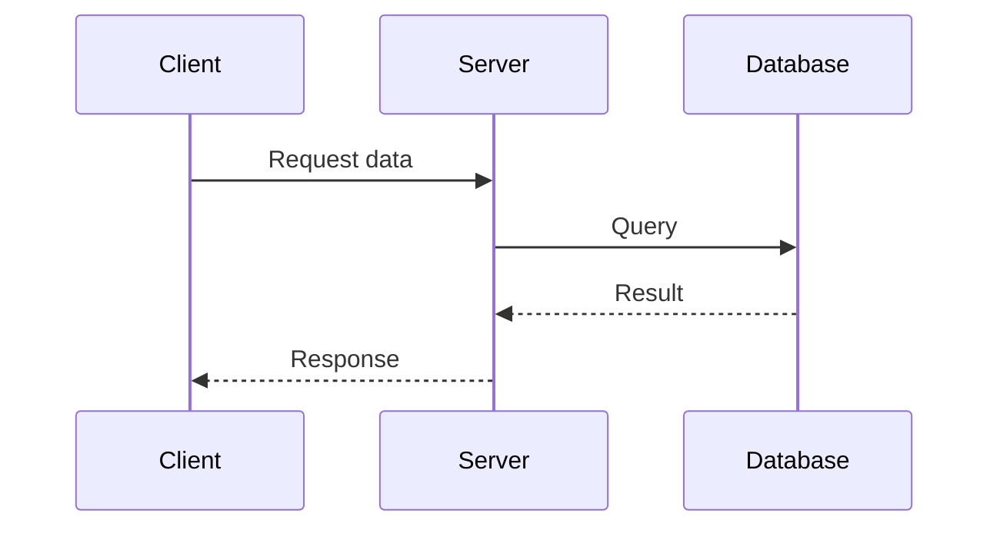
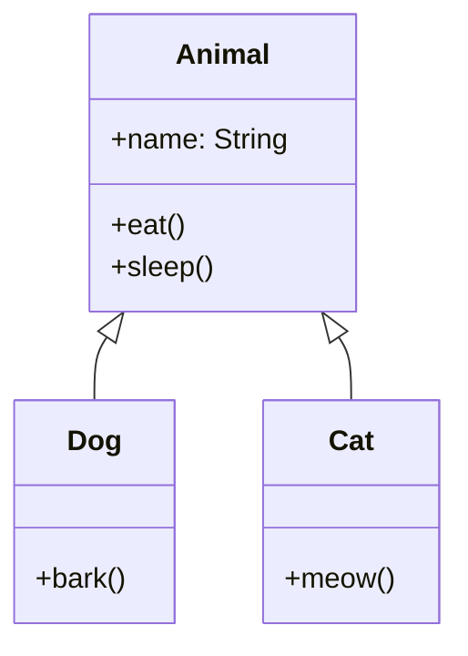

# Test Markdown with Mermaid

This is a test file to verify the memd.nvim plugin works correctly.

## Simple Flowchart

## Sequence Diagram

## Class Diagram

## Regular Text

This is just regular markdown text. It should render normally without any special processing.

- Point 1
- Point 2
- Point 3

**Bold** and *italic* text should work fine.

`Inline code` is also supported.
